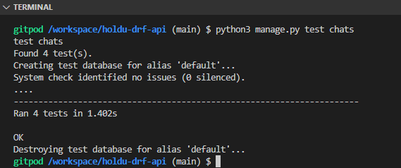

# Holdu
## Django REST API for Health and Social Sector: Job Application Platform

This project is a Django REST API designed for a social media job application platform tailored specifically for the health and social sector. Similar to LinkedIn, it facilitates interactions between employers and employees, with a focus on seamless job posting, application management, and offer processing.

*The deployed Drf Api link can be found here:* 

## Key Features:

* **Profile Types and Authentication:** Users are authenticated based on their profile type (employee or employer), ensuring secure access to relevant features and data.

* **Job Posting:** Employers can post job listings, detailing available positions within the health and social sector.

* **Application Management:** Employees can apply for jobs posted by employers, initiating a streamlined application process.

* **Applicant Tracking:** Employers can manage applicants by marking them as Shortlisted, Accepted, or Binned, streamlining the hiring process.

* **Offer Processing:** Once an applicant is accepted, the API facilitates the posting of offers, allowing applicants to respond accordingly.

* **Notification System:** Users receive notifications to stay updated on application status changes, messages, and other relevant activities within the platform.

* **Chat and Connections System:** A built-in chat system enables users to communicate with other users, potential employers, or employment partners, fostering connections and collaborations.

* **Rating System:** Users can rate and provide feedback on their experiences, enhancing transparency and trust within the community.

* **Showcasing Experience:** Users can showcase their professional experience and qualifications, providing comprehensive profiles for potential employers to review.

* **Interacting with Job Listings:** Users can engage with job listings by liking, commenting, and sharing, facilitating community interaction and engagement.

## Developer User Stories 

| Section 1 |
| --- |
| [**#1**](https://github.com/Ry-F3/holdu-drf-api/issues/1) As a backend developer, I want to implement CRUD functionality for user profiles, allowing users to create, read, update, and delete their profile information, including details about skills and experience, through API endpoints. |
| [**#2**](https://github.com/Ry-F3/holdu-drf-api/issues/2) As a backend developer, I want to implement endpoints for rating and reviewing other users, including logic to calculate average ratings and display them on user profiles. |
| [**#3**](https://github.com/Ry-F3/holdu-drf-api/issues/3) As a user, I want to be able to create three types of profiles on the platform: employee, employer, and admin, each with distinct permissions and features, to cater to different user roles and functionalities. |
| [**#4**](https://github.com/Ry-F3/holdu-drf-api/issues/4) As a backend developer, I want to implement search and filtering functionality for user profiles based on skills, ratings, and other relevant criteria, optimising queries for performance and scalability. |
| [**#5**](https://github.com/Ry-F3/holdu-drf-api/issues/5) As a backend developer, I want to define database models for job listings, including fields for job title, description, required skills, compensation, and other relevant details, implementing CRUD functionality for managing job listings. |

| Section 2 |
| --- |
| [**#6**](https://github.com/Ry-F3/holdu-drf-api/issues/6) As a backend developer, I want to implement database models and relationships for user connections, allowing users to send and accept connection requests and maintain a network of professional relationships. |
| [**#7**](https://github.com/Ry-F3/holdu-drf-api/issues/7) As a backend developer, I want to create API endpoints for managing user connections, including functionalities for sending connection requests, accepting or rejecting requests, and fetching connections' profiles. |
| [**#8**](https://github.com/Ry-F3/holdu-drf-api/issues/8) As a backend developer, I want to implement database models and relationships for direct messages, enabling users to send messages to specific connections. |
| [**#9**](https://github.com/Ry-F3/holdu-drf-api/issues/9) As a backend developer, I want to create API endpoints for managing direct messages, including functionalities for sending, receiving, and deleting messages. |
| [**#10**](https://github.com/Ry-F3/holdu-drf-api/issues/10) As a backend developer, I want to implement notification mechanisms for profile activities, including logic to trigger notifications when users receive connection requests, profile views, or messages. |

| Section 3 |
| --- |
| [**#11**](https://github.com/Ry-F3/holdu-drf-api/issues/11) As a developer working on the Jobs app, I want to implement likes and comments functionalities to work seamlessly with the existing features. This will enhance user engagement and provide a platform for users to interact with each other regarding job listings. |
| [**#12**](https://github.com/Ry-F3/holdu-drf-api/issues/12) As a developer, I want to integrate JWT tokens into my project to enhance security and provide authentication and authorization mechanisms for users. This involves generating tokens upon user authentication, validating tokens for each request, and managing token expiration and refreshment. |
| [**#13**](https://github.com/Ry-F3/holdu-drf-api/issues/13) As a developer, I want to deploy my project to Heroku with appropriate settings to make it accessible to users on the web. This involves configuring environment variables, setting up the necessary buildpacks, and ensuring compatibility with Heroku's platform. |
| [**#14**](https://github.com/Ry-F3/holdu-drf-api/issues/14) As a developer, I want to clean up and refactor my codebase to improve readability, maintainability, and performance. This involves identifying and removing redundant code, restructuring code for better organization, and optimising performance bottlenecks. |
| [**#15**](https://github.com/Ry-F3/holdu-drf-api/issues/15) As a developer, I want to connect my project to an external database (ElephantSQL) to store and manage persistent data. This involves configuring database connection settings, creating necessary database tables or collections, and implementing data access logic within the project. |
| [**#16**](https://github.com/Ry-F3/holdu-drf-api/issues/16) As a developer, I want to write tests for my code to ensure its correctness, reliability, and maintainability. This involves writing unit tests to cover individual functions or components, integration tests to test interactions between different parts of the system, and end-to-end tests. |

## Agile Methodology

GitHub Issues were utilised extensively throughout the development process of the project. These issues were tracked using the following link: [GitHub Issues](https://github.com/Ry-F3/holdu-drf-api/issues?q=is%3Aissue+is%3Aclosed).

Each developer story, representing a feature or task, was captured as a GitHub issue and categorised accordingly. To ensure clarity and organisation, labels were employed. These labels can be viewed at: [Labels](https://github.com/Ry-F3/holdu-drf-api/labels). Labels were used to categorise issues based on workflow, enhancements, or new features.

To provide a higher-level overview and categorisation, issues were grouped into six epics. These epics served to distinguish between different aspects or modules of the project, making it easier to manage and prioritise work. Priority labels were applied to issues to indicate their importance and urgency, aiding in the allocation of resources and prioritisation of tasks.

Throughout the development process, the project progressed through three sprints. To document the conclusion of each sprint and mark significant [milestones](https://github.com/Ry-F3/holdu-drf-api/milestones?state=closed).
, milestones were used. These milestones helped in tracking the project's progress over time and provided a clear indication of the completion of specific phases or iterations.

For visual representation and enhanced project management, three Kanban boards were utilised as sprints. The Kanban boards provided a visual overview of the project's progress, this allowed the tracking of tasks as they moved through various stages of completion. The Kanban boards for the project can be accessed via the following link: [Kanban Boards](https://github.com/Ry-F3/holdu-drf-api/projects?query=is%3Aopen).

#### Sprint 1 (March. 13th to 15th 2024)

Sprint details

1. **CRUD Functionality for User Profiles:**
* Implement Create, Read, Update, and Delete (CRUD) operations for user profiles.
* Allow users to manage their profile information, including skills and experience, through API endpoints.
2. **Endpoints for Rating and Reviewing Users:**
* Develop endpoints for users to rate and review each other.
* Calculate and display average ratings on user profiles.
3. **User Profile Creation with Different Permissions:**
* Enable users to create employee, employer, and admin profiles with distinct permissions and features.
* Implement role-based access control to cater to different user roles and functionalities.
4. **Search and Filtering Functionality for User Profiles:**
* Implement search and filtering functionality for user profiles based on skills, ratings, and other criteria.
* Optimise queries for performance and scalability.
5. **Database Models for Job Listings:**
* Define database models for job listings with fields such as title, description, skills, and compensation.
* Implement CRUD functionality for managing job listings.

All items completed on March. 15th 2024

[Sprint Kanban Board](https://github.com/users/Ry-F3/projects/3)

#### Sprint 2 (March. 15th to 20th 2024)

Sprint details

1. **Database Models and Relationships for User Connections:**
* Define database models and relationships to manage user connections.
* Allow users to send and accept connection requests, building a network of professional relationships.
2. **API Endpoints for Managing User Connections:**
* Create API endpoints to handle user connections.
* Implement functionalities for sending, accepting, or rejecting connection requests, and fetching connection profiles.
3. **Database Models and Relationships for Direct Messages:**
* Establish database models and relationships for direct messages between users.
* Enable users to send messages to specific connections.
4. **API Endpoints for Managing Direct Messages:**
* Develop API endpoints to manage direct messages.
* Implement functionalities for sending, receiving, and deleting messages.
5. **Notification Mechanisms for Profile Activities:**
* Implement notification mechanisms for profile activities, such as connection requests, profile views, and messages.
* Trigger notifications to inform users about relevant activities within the platform.
6. **Integration of Likes and Comments Functionality:**
* Integrate likes and comments functionalities into the existing features.
* Enhance user engagement and interaction regarding job listings.

All items completed on March. 20th 2024

[Sprint Kanban Board](https://github.com/users/Ry-F3/projects/4)

#### Sprint 3 (March. 20th to 23th 2024)

Sprint details

1. **Integration of JWT Tokens for Security:**
* Incorporate JWT tokens into the project for enhanced security.
* Implement authentication and authorization mechanisms, generating and validating tokens for user requests.
2. **Deployment to Heroku:**
* Deploy the project to Heroku with appropriate settings.
* Configure environment variables, buildpacks, and ensure compatibility with Heroku's platform for web accessibility.
3. **Connection to External Database (ElephantSQL):**
* Connect the project to an external database (ElephantSQL) for persistent data storage.
* Configure database connection settings, create necessary tables or collections, and implement data access logic.
4. **Writing Tests for Code Coverage:**
* Write tests to ensure code correctness, reliability, and maintainability.
* Include unit tests for individual functions/components, integration tests for interactions between different parts, and end-to-end tests.
5. **Codebase Cleanup and Refactoring (In Progress):**
* Note: Due to time constraints, further refinement of the codebase, including cleanup and optimisation, will be deferred to future iterations.

All items completed on March. 23th 2024 

[Sprint Kanban Board](https://github.com/users/Ry-F3/projects/5)

## Data Models

### Database Schema

*Please note: that the notification model has been omitted intentionally to maintain focus on the main features of the project and to prevent overloading the schema.*

### Profile Model
* Stores user profiles with information such as profile type, name, content, image, and average rating.
* Uses a one-to-one relationship with the Django User model for authentication and related ratings via a many-to-many relationship.

### Rating Model
* Represents ratings given by users to each other.
* Includes rating value, optional comment, and relationships with the user who received the rating and the user who gave the rating.

### Notification Model
* Manages notifications for users, including sender, category, read status, title, content, and associated item ID.
* Categories include connection requests, new job alerts, accepted applications, message alerts, and new ratings.

*Please note this model was heavily inspired by [Sonic Explorers API](https://github.com/nacht-falter/sonic-explorers-api)*

### Like Model
* Tracks likes given by users to specific job listings.
* Maintains relationships with both users and job listings, along with creation timestamp.

### Comment Model
* Represents comments made by users on specific job listings.
* Maintains relationships with both users and job listings, along with creation and update timestamps.

### WorkExperience Model
* Stores work experiences of users, including job title, company name, dates, skills, and job summary.
* Enforces uniqueness of job details per user and checks user profile type before saving.

### Connection Model
* Represents comments made by users on specific job listings.
* Maintains relationships with both users and job listings, along with creation and update timestamps.

### Chat Model
* Handles one-to-one chats between users, storing the sender, recipient, and timestamp.
* Enforces uniqueness to prevent duplicate messages within the chat list.

### Message Model
* Stores messages within chats, including sender, recipient, timestamp, and content.
* Ensures uniqueness to prevent duplicate messages within a chat.

## API Endpoints

| Endpoint | HTTP Method | CRUD | View Type | Permissions |
|----------|-------------|------|-----------|-------------|
| **Authentication and Profiles** |
| /api-auth/login/ | GET | N/A | N/A | Public |
| /api-auth/logout/ | GET | N/A | N/A | Public |
| /dj-rest-auth/registration/ | POST | N/A | N/A | Public |
| /dj-rest-auth/login/ | POST | N/A | N/A | Public |
| /dj-rest-auth/logout/ | POST | N/A | N/A | Authenticated |
| /profiles/ | GET | Read | List | Authenticated |
| /profiles/<int:pk>/ | GET | Read | Detail | Authenticated |
|  | PUT | Update | Detail | Owner |
| /profiles/<int:pk>/rate-user/ | POST | Create | Detail | Authenticated |
| /profiles/<int:pk>/ratings/ | GET | Read | Detail | Authenticated |
| /profiles/<int:pk>/ratings-edit | PUT | Update | Detail | Owner |
| **Job-related Endpoints** |
| /jobs/ | GET | Read | List | Public |
| /jobs/post/ | POST | Create | List | Authenticated |
| /jobs/post/<int:pk>/ | GET | Read | Detail | Public |
| /jobs/post/<int:pk>/apply/ | POST | Create | Detail | Authenticated |
| /jobs/post/<int:pk>/unapply/ | DELETE | Delete | Detail | Owner |
| /jobs/post/<int:pk>/applicants/ | GET | Read | Detail | Authenticated |
| /jobs/post/<int:pk>/applicants/<int:applicant_id>/ | GET | Read | Detail | Authenticated |
| /jobs/post/<int:job_id>/applicants/<int:applicant_id>/response/ | POST | Create | Detail | Authenticated |
| /jobs/post/<int:job_id>/employees/ | GET | Read | Detail | Authenticated |
| /jobs/post/<int:job_id>/employees/<int:employee_id>/ | GET | Read | Detail | Authenticated |
| **Work Experience Endpoints** |
| /work-experience/ | GET | Read | List | Authenticated |
| /work-experience/user/<int:user_id>/ | GET | Read | List | Authenticated |
| /work-experience/create/ | POST | Create | List | Authenticated |
| /work-experience/create/<int:pk>/ | PUT | Update | Detail | Owner |
| **Connections Endpoints** |
| /connections/ | GET | Read | List | Authenticated |
| /connections/<int:pk>/ | GET | Read | Detail | Authenticated |
| /accepted-connections/ | GET | Read | List | Authenticated |
| /pending-connections/ | GET | Read | List | Owner |
| /pending-connections/<int:pk>/accept/ | POST | Create | Detail | Owner |
| /pending-connections/<int:pk>/decline/ | POST | Create | Detail | Owner |
| **Chats Endpoints** |
| /chats/ | GET | Read | List | Authenticated |
|  | POST | Create | List | Authenticated |
| /chats/<int:pk>/ | GET | Read | Detail | Authenticated |

## Technologies Used

### Frameworks and Libraries

The API utilises [Django Rest Framework](https://www.django-rest-framework.org/) alongside Django, a toolkit for constructing APIs developed with Python.

### Key Python Packages

* [cloudinary](https://pypi.org/project/cloudinary/): Integrated for efficient media management and manipulation.
* [django-filter](https://pypi.org/project/django-filter/): Provides filtering with URL parameters for querysets.
* [psycopg2](https://pypi.org/project/psycopg2/): Facilitates seamless integration with PostgreSQL, a robust relational database management system.
* [dj-database-url](https://pypi.org/project/dj-database-url/): Streamlines Django database management, enabling easy configuration via URLs.
* [gunicorn](https://pypi.org/project/gunicorn/): Utilised as the WSGI server for deployment purposes.
* [django-cloudinary-storage](https://pypi.org/project/django-cloudinary-storage/): Enables Django to utilise Cloudinary as its default file storage backend.
* [django-allauth](https://pypi.org/project/django-allauth/): Empowers Django with advanced authentication and user management capabilities.
* [dj-rest-auth](https://pypi.org/project/dj-rest-auth/): Enhances DRF with comprehensive authentication features. Note: Version 2.2.8 or older is required for custom UserSerializer functionality.
* [django-cors-headers](https://pypi.org/project/django-cors-headers/): Facilitates handling of Cross-Origin Resource Sharing in Django.

### Other Software

- [GitHub](https://github.com/): Hosts the project repository, facilitating collaboration and version control.
- [GitHub Issues](https://docs.github.com/en/issues): Utilised for Agile methodology, assigning user stories to issues and organizing them with labels.
- [GitHub Projects](https://docs.github.com/en/issues/planning-and-tracking-with-projects/learning-about-projects/about-projects): Employed for Agile sprint planning and task tracking. 
- [GitHub CLI](https://cli.github.com/): Used for creating issues directly from the terminal.
- [Gitpod](https://www.gitpod.io/): IDE utilised for version control, enabling commits and pushes to GitHub from the command line.
- [Heroku](https://heroku.com/): Selected for deploying the API.
- [ElephantSQL](https://www.elephantsql.com/): Chosen for the project's PostgreSQL database.
- [Cloudinary](https://cloudinary.com/): Employed for storing media files.
- [Lucidchart](https://www.lucidchart.com/): Utilised to create the entity relationship diagram  for the project's data models.

## Testing

### Automated Testing

#### Unit and Intergration Testing

1. **Scope:**
    * Unit Testing: Focuses on testing individual units or components of a system in isolation, such as functions, methods, or classes.
    * Integration Testing: Focuses on testing the interactions and interfaces between multiple units or components to ensure they work together as expected.

2. **Dependencies:**
    * Unit Testing: Aims to eliminate external dependencies by mocking or stubbing them, allowing tests to focus solely on the behavior of the unit being tested.
    * Integration Testing: Tests the integration points and interactions between different units or components, including external dependencies such as databases, APIs, or third-party services.

3. **Isolation:**
    * Unit Testing: Tests are typically isolated from other parts of the system, ensuring that failures are localized and easy to diagnose.
    * Integration Testing: Tests the system as a whole or significant portions of it, including the interactions between different components, allowing for the detection of issues that arise from the integration of these components.

4. **Granularity:**
    * Unit Testing: Offers finer granularity, allowing developers to test individual functionalities and edge cases within a specific unit or component.
    * Integration Testing: Provides broader coverage, verifying that the system's components work together correctly and handle interactions as expected.

5. **Execution Time:**
    * Unit Testing: Generally faster to execute since tests focus on smaller units and have fewer dependencies.
    * 8Integration Testing: May take longer to execute due to the involvement of multiple components and dependencies.

In summary, while unit testing validates the correctness of individual units or components in isolation, integration testing ensures that these units collaborate effectively and produce the desired outcomes when integrated into the larger system. Both types of testing play complementary roles in ensuring the overall quality and reliability of software systems.

Test profiles (TestCase)

* **Purpose:** Tests the assignment of profile types (admin, employee, employer) to user profiles.

* **Type:** Unit testing.

Test jobs (TestCase)

* **Purpose:** Tests job application functionality including applying for a job, unapplying for a job, and handling closed job listings.

* **Type:** Integration testing.

Test experience (TestCase)

* **Purpose:** Tests CRUD operations for work experiences associated with user profiles.

* **Type:** Integration testing.

Test connections (TestCase)

* **Purpose:** Tests CRUD operations for user connections.

* **Type:** Integration testing.

Test chats  (APITestCase)

* **Purpose:** Tests CRUD operations for user chats and messages.

* **Type:** Integration testing.

Test comments (TestCase)

* **Purpose:** Tests CRUD operations for comments on job listings.

* **Type:** Integration testing.

Test likes (TestCase)

* **Purpose:** Tests CRUD operations for likes on job listings.
* **Type:** Integration testing.

Test notifications (APITestCase)

* **Purpose:** Tests notification creation signals for various events like new connections, messages, jobs, and ratings.

* **Type:** Integration testing.

Test all

[#16](https://github.com/Ry-F3/holdu-drf-api/issues/16) highlights an unresolved bug in the comments section. Please refer to the issue for further details.

### PEP 8 

All files underwent validation using a Python linter, specifically [PEP 8](https://pep8ci.herokuapp.com/). Most errors identified by the linter were addressed, ensuring adherence to the PEP 8 style guide. Remaining errors primarily stemmed from strings being excessively long, which led to futher errors if line breaks were to be introduced. Some of these long strings were reworded to comply with PEP 8 standards and eliminate the errors flagged by the linter.

Reveal remaining errors

#### App: experience 
#### File: models.py

#### App: notifications 
#### File: signals.py

#### App: notifications
#### File: tests.py

